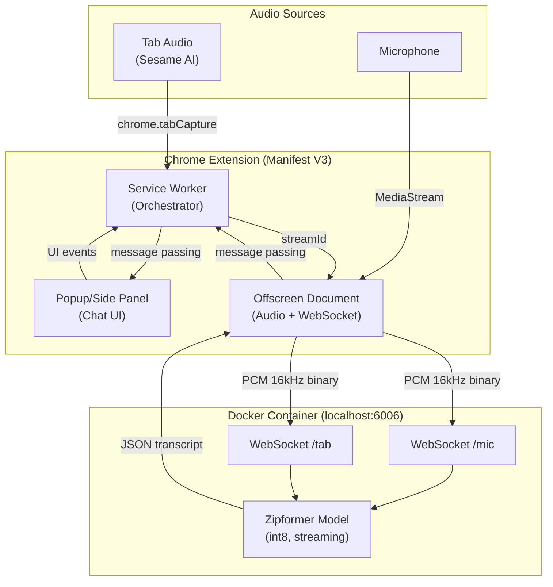
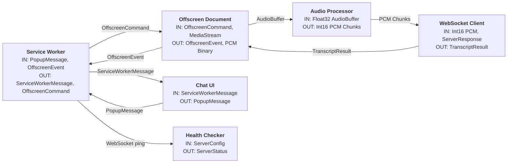
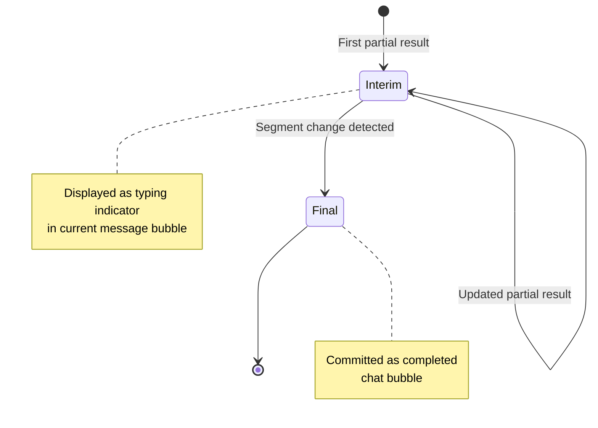
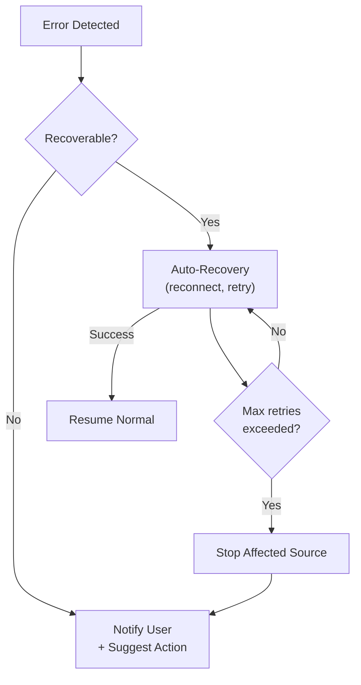

# Design Document: STT Zipformer Extension

## Overview

Extension Chrome Speech-to-Text sử dụng model Zipformer streaming chạy trên localhost. Extension capture audio từ hai nguồn (microphone + tab audio), stream qua WebSocket đến STT server, và hiển thị kết quả dạng chat session.

### Key Design Decisions

1. **Manifest V3 + Offscreen Document**: Sử dụng Chrome Manifest V3 với offscreen document để xử lý audio và WebSocket trong background, tránh mất kết nối khi popup đóng.
2. **Dual WebSocket Connections**: Mỗi audio source có WebSocket connection riêng đến STT server, cho phép server xử lý độc lập và trả kết quả riêng biệt.
3. **AudioWorklet cho Audio Processing**: Sử dụng AudioWorklet (thay vì deprecated ScriptProcessorNode) để capture và resample audio với hiệu suất cao.
4. **Service Worker Orchestration**: Service worker đóng vai trò orchestrator, quản lý lifecycle và message passing giữa các components.
5. **Docker Backend**: STT server (sherpa-onnx) chạy trong Docker container, extension chỉ cần kết nối WebSocket đến container. Không cần Native Messaging host — đơn giản hóa deployment và tránh phụ thuộc vào hệ thống host.

### Technology Stack

- **Chrome Extension**: Manifest V3
- **Audio Processing**: Web Audio API + AudioWorklet
- **Communication**: WebSocket (binary frames cho audio, text frames cho results)
- **STT Server**: sherpa-onnx streaming WebSocket server chạy trong Docker container
- **Model**: sherpa-onnx-streaming-zipformer-en-2023-06-21 (int8)
- **Backend Infrastructure**: Docker + Docker Compose
- **UI Framework**: Vanilla JS + CSS (lightweight cho extension popup/side panel)

## Architecture

### High-Level Architecture



### Component Communication Flow

```mermaid
sequenceDiagram
    participant User
    participant Popup as Popup UI
    participant SW as Service Worker
    participant Off as Offscreen Doc
    participant STT as STT Server

    User->>Popup: Click "Conversation Mode"
    Popup->>SW: start-conversation
    SW->>SW: chrome.tabCapture.getMediaStreamId()
    SW->>Off: start-recording {streamId, micEnabled}
    Off->>Off: getUserMedia(mic) + getUserMedia(tab)
    Off->>Off: AudioWorklet resample to 16kHz PCM
    Off->>STT: WebSocket connect (mic)
    Off->>STT: WebSocket connect (tab)
    loop Every 0.5s
        Off->>STT: Binary PCM chunk (mic)
        Off->>STT: Binary PCM chunk (tab)
    end
    STT-->>Off: JSON {text, is_final, source}
    Off-->>SW: transcript-update
    SW-->>Popup: transcript-update
    Popup->>Popup: Render chat message
```

## Components and Interfaces

### 1. Service Worker (Background Script)

**Responsibility**: Orchestration, lifecycle management, message routing, tab capture initiation.

```typescript
// src/modules/service-worker/service-worker.types.ts

interface ExtensionState {
  serverStatus: 'stopped' | 'starting' | 'ready' | 'error';
  micRecording: boolean;
  tabRecording: boolean;
  activeTabId: number | null;
  config: ExtensionConfig;
}

interface ExtensionConfig {
  serverHost: string;       // default: 'localhost'
  serverPort: number;       // default: 6006
  modelPath: string;        // path to sherpa-onnx model
  audioChunkSizeMs: number; // default: 500 (0.5s)
}

// Messages from Popup → Service Worker
type PopupMessage =
  | { type: 'start-mic-recording' }
  | { type: 'stop-mic-recording' }
  | { type: 'start-tab-recording'; tabId: number }
  | { type: 'stop-tab-recording' }
  | { type: 'start-conversation' }
  | { type: 'stop-conversation' }
  | { type: 'get-state' }
  | { type: 'update-config'; config: Partial<ExtensionConfig> }
  | { type: 'clear-session' }
  | { type: 'copy-transcript' };

// Messages from Service Worker → Popup
type ServiceWorkerMessage =
  | { type: 'state-update'; state: ExtensionState }
  | { type: 'transcript-update'; message: ChatMessage }
  | { type: 'error'; error: string; source: string };
```

### 2. Offscreen Document (Audio Processing + WebSocket)

**Responsibility**: Audio capture, resampling, WebSocket communication with STT server.

```typescript
// src/modules/offscreen/offscreen.types.ts

interface AudioConfig {
  sampleRate: number;       // 16000
  channels: number;         // 1 (mono)
  bitDepth: number;         // 16
  chunkSizeMs: number;      // 500
}

interface WebSocketConfig {
  url: string;              // ws://localhost:6006
  reconnectAttempts: number; // 3
  reconnectIntervalMs: number; // 1000
}

// Messages from Service Worker → Offscreen
type OffscreenCommand =
  | { type: 'start-mic'; config: AudioConfig }
  | { type: 'stop-mic' }
  | { type: 'start-tab'; streamId: string; config: AudioConfig }
  | { type: 'stop-tab' }
  | { type: 'stop-all' };

// Messages from Offscreen → Service Worker
type OffscreenEvent =
  | { type: 'transcript'; data: TranscriptResult }
  | { type: 'recording-started'; source: AudioSource }
  | { type: 'recording-stopped'; source: AudioSource }
  | { type: 'connection-error'; source: AudioSource; error: string }
  | { type: 'reconnecting'; source: AudioSource; attempt: number };

type AudioSource = 'mic' | 'tab';
```

### 3. Audio Processor (AudioWorklet)

**Responsibility**: Capture raw audio from MediaStream, resample to 16kHz mono, buffer into chunks.

```typescript
// src/modules/audio-processor/audio-processor.types.ts

interface AudioProcessorOptions {
  targetSampleRate: number;  // 16000
  chunkSizeMs: number;       // 500
  sourceSampleRate: number;  // from AudioContext (usually 44100 or 48000)
}

// AudioWorklet → Main thread messages
interface AudioChunkMessage {
  type: 'audio-chunk';
  pcmData: Int16Array;       // 16-bit PCM samples
  timestamp: number;
}

interface AudioProcessorState {
  isProcessing: boolean;
  samplesBuffered: number;
  chunksEmitted: number;
}
```

### 4. WebSocket Client

**Responsibility**: Manage WebSocket connection to STT server, send audio chunks, receive transcripts.

```typescript
// src/modules/websocket-client/websocket-client.types.ts

interface TranscriptResult {
  text: string;
  isFinal: boolean;
  source: AudioSource;
  timestamp: number;
  segmentId: string;
}

// sherpa-onnx WebSocket protocol:
// Client → Server: Binary frames (PCM int16 samples, 16kHz mono)
// Server → Client: Text frames (JSON with recognition result)
// Client → Server: Text frame "Done" to signal end of stream

interface SherpaOnnxResponse {
  text: string;
  tokens: string[];
  timestamps: number[];
  segment: number;
}

interface WebSocketClientState {
  status: 'disconnected' | 'connecting' | 'connected' | 'reconnecting';
  reconnectAttempt: number;
  messagesReceived: number;
}
```

### 5. Popup/Side Panel (Chat UI)

**Responsibility**: Display chat session, control recording, show status.

```typescript
// src/modules/chat-ui/chat-ui.types.ts

interface ChatMessage {
  id: string;
  sender: 'user' | 'sesame';
  text: string;
  timestamp: number;
  isFinal: boolean;
  segmentId: string;
}

interface ChatSession {
  id: string;
  messages: ChatMessage[];
  startedAt: number;
  isActive: boolean;
}

interface UIState {
  session: ChatSession;
  serverStatus: 'stopped' | 'starting' | 'ready' | 'error';
  micRecording: boolean;
  tabRecording: boolean;
  conversationMode: boolean;
}
```

### 6. STT Server (Docker Backend)

**Responsibility**: Run sherpa-onnx WebSocket server in Docker container, health monitoring via HTTP/WebSocket ping.

```typescript
// src/modules/stt-server/stt-server.types.ts

interface ServerConfig {
  host: string;              // default: 'localhost'
  port: number;              // default: 6006
  dockerImage: string;       // default: 'stt-zipformer-server'
  numThreads: number;        // default: 2
  maxBatchSize: number;      // default: 5
  decodingMethod: 'greedy_search' | 'modified_beam_search';
}

interface ServerStatus {
  state: 'stopped' | 'starting' | 'ready' | 'error' | 'unresponsive';
  containerId: string | null;
  uptime: number;
  lastHealthCheck: number;
  errorMessage: string | null;
}
```

### Docker Configuration

**Dockerfile** (sherpa-onnx WebSocket server):
```dockerfile
FROM python:3.11-slim

RUN pip install sherpa-onnx

# Download model
RUN python -c "import sherpa_onnx; sherpa_onnx.download_model('sherpa-onnx-streaming-zipformer-en-2023-06-21')"

EXPOSE 6006

CMD ["python", "-m", "sherpa_onnx.streaming_server", \
     "--port=6006", \
     "--encoder=encoder-epoch-99-avg-1-chunk-16-left-128.int8.onnx", \
     "--decoder=decoder-epoch-99-avg-1-chunk-16-left-128.onnx", \
     "--joiner=joiner-epoch-99-avg-1-chunk-16-left-128.int8.onnx", \
     "--tokens=tokens.txt"]
```

**docker-compose.yml**:
```yaml
version: '3.8'
services:
  stt-server:
    build: ./docker
    container_name: stt-zipformer-server
    ports:
      - "6006:6006"
    restart: unless-stopped
    deploy:
      resources:
        limits:
          memory: 1G
```

Extension chỉ cần kết nối WebSocket đến `ws://localhost:6006`. Server lifecycle được quản lý bởi Docker — user start/stop container bằng `docker compose up -d` / `docker compose down`. Extension kiểm tra server availability bằng WebSocket health check ping.

### Module Interaction Diagram



## Data Models

### Chrome Extension Manifest

```json
{
  "manifest_version": 3,
  "name": "STT Zipformer",
  "version": "1.0.0",
  "permissions": [
    "tabCapture",
    "offscreen",
    "storage"
  ],
  "background": {
    "service_worker": "service-worker.js"
  },
  "action": {
    "default_popup": "popup.html"
  },
  "icons": { "16": "icons/16.png", "48": "icons/48.png", "128": "icons/128.png" }
}
```

### Audio Data Flow

```
Source (44.1kHz/48kHz) → AudioContext → AudioWorklet (resample to 16kHz)
→ Buffer (500ms chunks) → Int16Array → WebSocket (binary frame)
```

**Audio Format Specification:**
- Sample Rate: 16,000 Hz
- Channels: 1 (mono)
- Bit Depth: 16-bit signed integer (Int16)
- Chunk Duration: 500ms = 8,000 samples = 16,000 bytes per chunk
- Byte Order: Little-endian (native)

### WebSocket Protocol (sherpa-onnx)

**Client → Server:**
- Binary frames: Raw PCM int16 samples (16kHz, mono, little-endian)
- Text frame `"Done"`: Signal end of audio stream

**Server → Client:**
- Text frames: JSON response with recognition result

```typescript
// Server response format
interface SherpaResponse {
  text: string;        // Recognized text (cumulative for the segment)
  tokens: string[];    // Individual tokens
  timestamps: number[]; // Token timestamps
  segment: number;     // Segment index (increments on endpoint detection)
}
```

**Endpoint Detection**: sherpa-onnx server has built-in endpoint detection. When silence is detected after speech, it finalizes the current segment and increments the segment counter. The client uses segment changes to determine when a message is "final".

### Storage Schema (chrome.storage.local)

```typescript
interface StorageSchema {
  config: ExtensionConfig;
  sessions: ChatSession[];       // Previous sessions (max 50)
  currentSessionId: string | null;
}
```

### Message Lifecycle



## Correctness Properties

*A property is a characteristic or behavior that should hold true across all valid executions of a system — essentially, a formal statement about what the system should do. Properties serve as the bridge between human-readable specifications and machine-verifiable correctness guarantees.*

### Property 1: Audio resampling preserves duration and produces correct format

*For any* audio buffer of Float32 samples at any supported source sample rate (44100Hz or 48000Hz), resampling to 16kHz mono SHALL produce an Int16Array where the output sample count equals `inputSamples * (16000 / sourceSampleRate)` (±1 sample tolerance), and all output values are within the Int16 range [-32768, 32767].

**Validates: Requirements 2.2, 3.2**

### Property 2: Audio chunking emits at correct boundaries

*For any* stream of PCM samples at 16kHz, the audio chunker SHALL emit chunks of exactly 8000 samples (500ms), and the total samples emitted across all chunks SHALL equal the total input samples minus any remainder less than 8000.

**Validates: Requirements 4.3**

### Property 3: WebSocket reconnection respects retry limits

*For any* sequence of WebSocket connection failure events, the client SHALL attempt reconnection at most 3 times. After 3 consecutive failures without a successful connection in between, the client SHALL transition to a 'failed' state and not attempt further reconnections.

**Validates: Requirements 4.4**

### Property 4: Chat messages are always chronologically ordered

*For any* list of ChatMessages with arbitrary timestamps and mixed sources (user/sesame), the displayed message order SHALL be sorted by timestamp in ascending order. Inserting a new message SHALL maintain this sorted invariant.

**Validates: Requirements 5.1, 6.3**

### Property 5: Rendered chat message contains all required fields

*For any* ChatMessage with a sender ('user' or 'sesame'), non-empty text, and a valid timestamp, the rendered output SHALL contain the sender label ("You" or "Sesame"), the transcript text, and a formatted timestamp string.

**Validates: Requirements 5.2**

### Property 6: Clipboard format is a faithful representation of the conversation

*For any* non-empty list of ChatMessages, the clipboard-formatted text SHALL contain one line per message in the format `"SenderLabel: text"`, and the lines SHALL appear in the same chronological order as the messages in the session.

**Validates: Requirements 5.7**

### Property 7: Configuration validation correctly classifies inputs

*For any* configuration field and input value: port values outside [1, 65535] or non-integer SHALL be rejected; host values that are empty strings SHALL be rejected; audioChunkSizeMs values outside [100, 2000] SHALL be rejected. Valid values within these ranges SHALL be accepted.

**Validates: Requirements 7.2**

## Error Handling

### Error Categories

| Category | Source | Handling Strategy |
|----------|--------|-------------------|
| Server Unavailable | Health Checker | Display error: "STT Server not running. Start with: docker compose up -d" |
| Port Conflict | Health Checker | Notify user, suggest checking Docker container or changing port |
| Microphone Not Found | Audio Processor | Display "Microphone required" error |
| Tab Capture Denied | Service Worker | Display permission instructions |
| WebSocket Disconnect | WebSocket Client | Auto-reconnect (3 attempts, 1s interval) |
| Reconnection Failed | WebSocket Client | Stop recording, notify user |
| Server Unresponsive | Health Checker | Display "Server unresponsive" after 10s, suggest restarting container |
| Invalid Config | Config Validator | Show validation error, retain previous value |

### Error Flow



### Module-Specific Error Classes

```typescript
// src/shared/errors.ts

abstract class ExtensionError extends Error {
  abstract readonly code: string;
  abstract readonly recoverable: boolean;
  abstract readonly userMessage: string;
}

// src/modules/stt-server/errors.ts
class ServerUnavailableError extends ExtensionError {
  code = 'SERVER_UNAVAILABLE';
  recoverable = false;
  userMessage: string;
  constructor() {
    super('STT Server is not running');
    this.userMessage = 'STT Server is not running. Start it with: docker compose up -d';
  }
}

class ServerUnresponsiveError extends ExtensionError {
  code = 'SERVER_UNRESPONSIVE';
  recoverable = false;
  constructor() {
    super('STT Server is unresponsive');
    this.userMessage = 'STT Server is unresponsive. Try restarting: docker compose restart';
  }
}

// src/modules/websocket-client/errors.ts
class ConnectionLostError extends ExtensionError {
  code = 'WS_CONNECTION_LOST';
  recoverable = true;
  userMessage = 'Connection lost. Attempting to reconnect...';
}

class ReconnectionFailedError extends ExtensionError {
  code = 'WS_RECONNECT_FAILED';
  recoverable = false;
  constructor(source: AudioSource) {
    super(`Reconnection failed for ${source}`);
    this.userMessage = `Could not reconnect ${source} stream. Recording stopped.`;
  }
}

// src/modules/audio-processor/errors.ts
class MicrophoneNotFoundError extends ExtensionError {
  code = 'MIC_NOT_FOUND';
  recoverable = false;
  userMessage = 'No microphone detected. Please connect a microphone and try again.';
}

class TabCaptureError extends ExtensionError {
  code = 'TAB_CAPTURE_DENIED';
  recoverable = false;
  userMessage = 'Tab audio capture permission denied. Click the extension icon on the tab you want to capture.';
}
```

## Testing Strategy

### Dual Testing Approach

This project uses both unit/example-based tests and property-based tests for comprehensive coverage.

### Property-Based Testing

**Library**: [fast-check](https://github.com/dubzzz/fast-check) (TypeScript PBT library)

**Configuration**: Minimum 100 iterations per property test.

**Tag Format**: `Feature: stt-zipformer-extension, Property {number}: {property_text}`

| Property | Module Under Test | Key Generators |
|----------|-------------------|----------------|
| 1: Audio resampling | audio-processor | Arbitrary Float32Arrays at 44100/48000 Hz |
| 2: Audio chunking | audio-processor | Arbitrary-length Int16Arrays |
| 3: Reconnection limits | websocket-client | Sequences of connect/disconnect events |
| 4: Chronological ordering | chat-ui | Lists of ChatMessages with random timestamps |
| 5: Message rendering | chat-ui | Arbitrary ChatMessage objects |
| 6: Clipboard formatting | chat-ui | Lists of ChatMessages |
| 7: Config validation | config | Arbitrary strings/numbers for each config field |

### Unit Tests (Example-Based)

| Area | Test Focus |
|------|------------|
| UI State Mapping | Server status → UI indicator (1.3, 1.4, 1.5) |
| Recording Indicators | micRecording/tabRecording → visual indicators (2.3, 3.3) |
| Partial vs Final | isFinal flag → typing indicator vs committed bubble (5.4, 5.5) |
| Session Management | New session preserves old sessions (5.9) |
| Conversation Mode | Button starts both recorders + new session (6.4) |
| Health Check Timeout | 10s timeout → terminate + notify (8.5) |

### Integration Tests

| Area | Test Focus |
|------|------------|
| Server Lifecycle | Start/stop server process, health check (1.1, 8.1) |
| Media Capture | getUserMedia with correct constraints (2.1, 2.4) |
| Tab Capture | chrome.tabCapture.getMediaStreamId flow (3.1, 3.4) |
| WebSocket Protocol | Connect, send binary, receive JSON, send "Done" (4.1, 4.2, 4.6) |
| Simultaneous Recording | Both sources active with separate connections (6.1, 6.2) |
| Resource Cleanup | All resources released on deactivation (8.2, 8.3, 8.4) |

### Test File Structure

```
src/
  modules/
    audio-processor/
      audio-processor.service.ts
      audio-processor.service.test.ts      ← Unit + Property tests
    websocket-client/
      websocket-client.service.ts
      websocket-client.service.test.ts     ← Unit + Property tests
    chat-ui/
      chat-ui.service.ts
      chat-ui.service.test.ts              ← Unit + Property tests
    config/
      config.validator.ts
      config.validator.test.ts             ← Unit + Property tests
    stt-server/
      stt-server.service.ts
      stt-server.service.test.ts           ← Unit tests
    service-worker/
      service-worker.test.ts               ← Integration tests
```

### Test Runner

- **Framework**: Vitest (fast, TypeScript-native, compatible with fast-check)
- **Run command**: `vitest --run` (single execution, no watch mode)
- **Coverage target**: >80% for pure logic modules (audio-processor, chat-ui, config)
