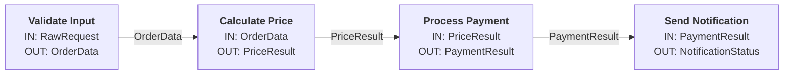

# Module Block Diagram

## Quy tắc bắt buộc

Sau khi hoàn thành code một module/tính năng, **PHẢI** cập nhật sơ đồ khối tại `docs/module-diagram.md`.

## Format sơ đồ khối

Dùng Mermaid flowchart. Mỗi khối gồm: **Tên module**, **Input**, **Output**.

### Cấu trúc mỗi khối
```
ModuleName["<b>Module Name</b><br/>IN: InputType<br/>OUT: OutputType"]
```

### Kết nối giữa các khối
```
ModuleA -->|OutputType| ModuleB
```

### Ví dụ hoàn chỉnh


## Quy tắc cập nhật

1. Khi tạo module mới → thêm khối mới vào diagram
2. Khi module kết nối với module khác → thêm mũi tên với label là kiểu data truyền
3. Khi thay đổi input/output của module → cập nhật khối tương ứng
4. Khi xóa module → xóa khối và các kết nối liên quan
5. Giữ diagram đơn giản, chỉ thể hiện data flow chính giữa các module

## File location

Sơ đồ khối nằm tại: `docs/module-diagram.md`
