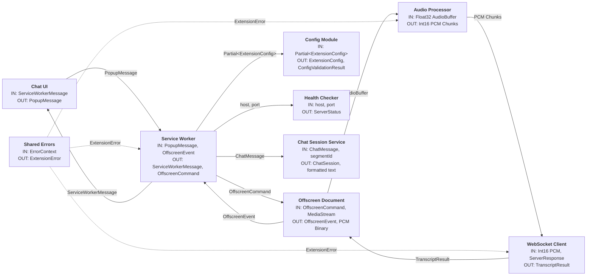

# Module Block Diagram

## STT Zipformer Extension - Architecture Overview

## Module Status

| Module | Status | Notes |
|--------|--------|-------|
| Config | ✅ Complete | Validator + Storage service (`config.validator.ts`, `config.service.ts`) |
| Audio Processor | ✅ Complete | AudioWorklet resampling + service + chunker (`audio-processor.worklet.ts`, `audio-processor.service.ts`, `internal/resampler.ts`, `internal/chunker.ts`) |
| WebSocket Client | ✅ Complete | Service with reconnection logic (`websocket-client.service.ts`) |
| Chat UI | ✅ Complete | Session service + renderer + clipboard formatter + popup controller (`chat-ui.service.ts`, `chat-ui.renderer.ts`, `chat-ui.clipboard.ts`, `popup.ts`, `popup.html`, `popup.css`) |
| STT Server (Health Checker) | ✅ Complete | Docker health checking service (`stt-server.service.ts`) |
| Offscreen | ✅ Complete | Audio + WebSocket orchestration (`offscreen.ts`, `offscreen.orchestrator.ts`) |
| Service Worker | ✅ Complete | State management + message routing + tab capture + conversation mode + health check integration + deactivation (`service-worker.ts`) |
